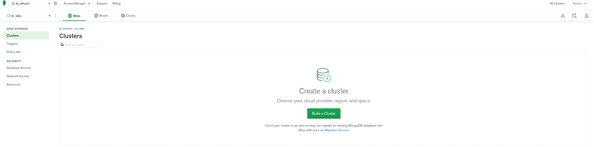
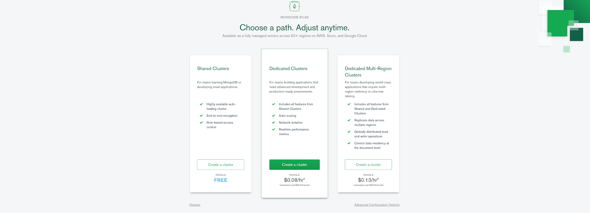
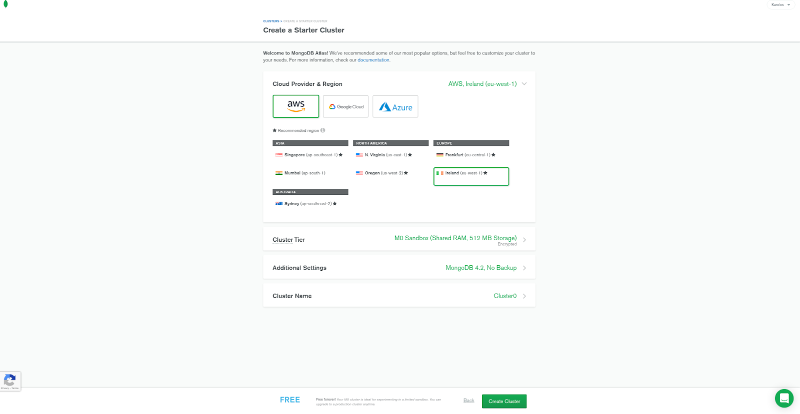
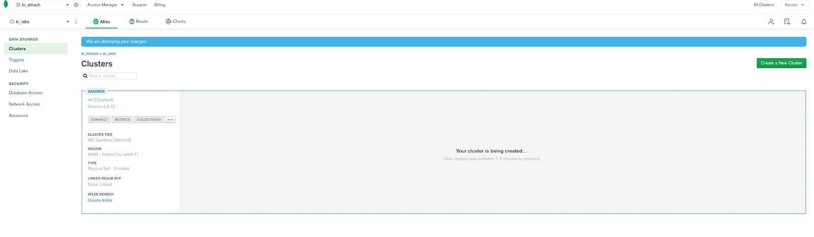
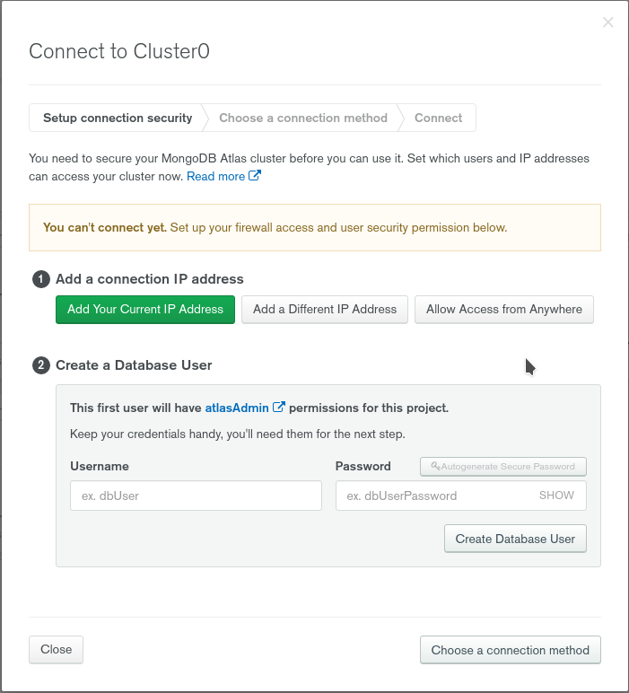
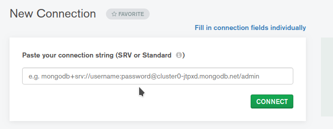

- Go to https://www.mongodb.com/cloud/atlas
- Create an account or sign in 
- If you have already created an organization and a project you should see something like this:

- Click on Build a cluster and you will be redirected at:

- Pick free tier
- There will be several options now available. All the providers will have an available free option. Note that this will be free forever -at least for the time being- if you do not change any of the settings in Cluster Tier. This is a sandbox database so performance does not matter, but you would want to pick an option -location wise- near you. 

- Click on create cluster and wait some minutes for this to be ready.

- As soon as this is done you can try to connect to your instance with any of mongo shell, compass or an application. 
- You will be prompted to set up firewall access and a database user. Choose allow access from anywhere (click add IP address) and enter credentials that you will use to connect to the database (create database user).


- When you are done click on Choose a connection method
  - Assuming you have compass installed you can get directly the connection string when you pick compass in the connection methods and create a new connection in compass
  
  
  - If you wish to connect via Python you can do so with the below code
  ```python
  import pymongo
  client = pymongo.MongoClient("connection_string")
  db = client.test
  ```
  You will need to install the packages pymongo and dnspython for the srv connection string.  


### Notes
- If you are a first time user in Atlas you should create an organization and then also create a project in order to have the build cluster option enabled.
- Note that in the case you will be using MongoDB locally the connection string would simply be mongodb://localhost:27017/
   - Python connection example:
  `conn = pymongo.MongoClient("mongodb://localhost:27017/")`
   - Compass connection example:
  `mongodb://localhost:27017/`
