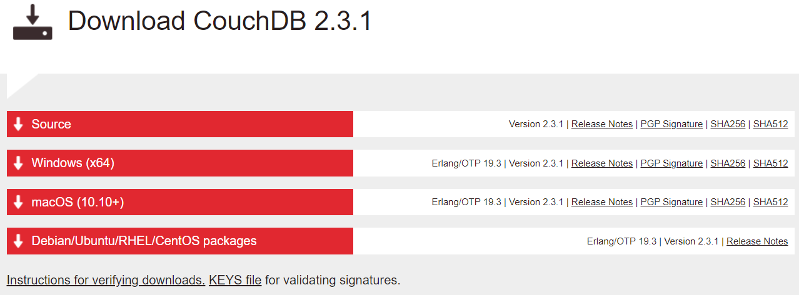

In this github page you can find some basic guidelines of how to install the software that we will use in the NoSQL class. Overall we will use
- MongoDB
- CouchDB
- Redis
- Python

You will find some instructions for windows and linux users (Ubuntu 20.04 based). 

## MongoDB
MongoDB is a cross-platform document-oriented database program. Classified as a NoSQL database program, MongoDB uses JSON-like documents with optional schemas

### Cloud 

It is recommended to setup an account in Atlas and create a free tier cluster there. The process is straight forward but you can find some details [here](docs/atlas.md). 

### Windows
- Go to https://www.mongodb.com/try/download/community?tck=docs_server and pick your platform and package. Get the current versions (At this time 4.4.1)
This link will provide direct download for Windos msi package for V4.4.4.1: https://fastdl.mongodb.org/windows/mongodb-windows-x86_64-4.4.1-signed.msi
- Keep the options as is and keep also enabled the install MongoDB Compass enabled
- When the installation ends, and if you let everythong default, an application will pop up (Compass, DBMS for mongo) which will ask you if you wish to send any reports to the developets. Do as you wish at this point. 
- After that it will prompt you for a new connection. If you let it empty it will connect to the default (localhost)

- You will be able now to see your instance and start working with it (Databases shown below are the default ones)

- In order to connect with the sell navigate to the directory you installed MongoDB (Something like `C:\Program Files\MongoDB\Server\4.4\bin`) with your cmd and type `mongo` and it will create a connection to your local instance


### Linux

## CouchDB
Apache CouchDB is an open-source document-oriented NoSQL database, implemented in Erlang. CouchDB uses multiple formats and protocols to store, transfer, and process its data, it uses JSON to store data, JavaScript as its query language using MapReduce, and HTTP for an API.

### Windows
- Go to https://couchdb.apache.org/#download and get the latest 2.X version for Windows. Do *not* get the version 3.X 

- Run the typical wizard  and keep default values
- Complete the installation wizard
- Search for `Fauxton` (CouchDB DBMS) and click on the result in the websites or go to your browser at http://localhost:5984/_utils/index.html 


- You should be able to see something like this


### Linux

- Enable Apache CouchDB packare repo
```cmd
sudo apt-get install -y gnupg ca-certificates
```
- Install needed packages
```cmd
sudo apt-key adv --keyserver keyserver.ubuntu.com --recv-keys \
  8756C4F765C9AC3CB6B85D62379CE192D401AB61
```

- Update repo cache and install the package
```cmd
sudo apt update
sudo apt install -y couchdb
```
In the wizard that it will appear pick Standalone/ let the bind address as it is/ and optionally enter a password for your admin. If you do so please remember it.


Visit Fauxton when the process ends at: http://127.0.0.1:5984/_utils/#

You can start/stop/restart couchdb with:

```cmd
sudo systemctl start couchdb 
sudo systemctl stop couchdb
sudo systemctl restart couchdb 
```

## Redis
Redis is a NO-SQL, key-value in-memory remote database that offers high performance, replication, and a unique data model. 

### Windows
- Go to https://github.com/microsoftarchive/redis/releases/tag/win-3.0.504


- Download the msi file. You can download alterantively the zip file but you will need to add manually environmental variables.
- Assuming that we are using the msi file, go over the typical installation wizard but do not forget to check the add to path variable.


- Let the port number and the add exception as it is and continue with the default values in the wizard
- With msi installer the redis-server will automatically run in the background when the system starts


- In order to connect to the redis server open a cmd and type `redis-cli`. If everything is correct you will connect to your local instance and you will be able to start interacting with the redis server. You can try `SET key value` and it should return `OK` and then `GET key` to get the assigned value.


### Linux

- In you terminal execute:
```cmd
sudo apt update
sudo apt install redis-server
```
This will install redis with all its dependecies.

- Check that redis is running
```cmd
sudo systemctl status redis
```
- If it does not run try:
```cmd
sudo systemctl start redis
```
- You should be able now to use the redis-cli and connect to your local instance.
```cmd
redis-cli
127.0.0.1:6379> ping
PONG
127.0.0.1:6379> 
```

## Python

We will need Python > 3.5 version in order to build some simple CRUD applications and demonstrate how to use NoSQL data stores within applications.
Linux and Mac users should have both 2.7.x and > 3.6.x versions installed by default on their machines. You can check your current version for both of them with:

```
python --version
python3 --version
```


Windows users please go at https://www.python.org/downloads/windows/ and get the appropriate file for your PC. Please note that during the installation you will be asked to add Python in Path. You should enable this option. 


It allows you to run your files on cmd by: 

```
python python_file.py
```

If you do not enable this you will be forced to use the full python path to execute your programs. (for example, it will be something like: 
c:/users/username/program files/python36/python pytthon_file.py )
